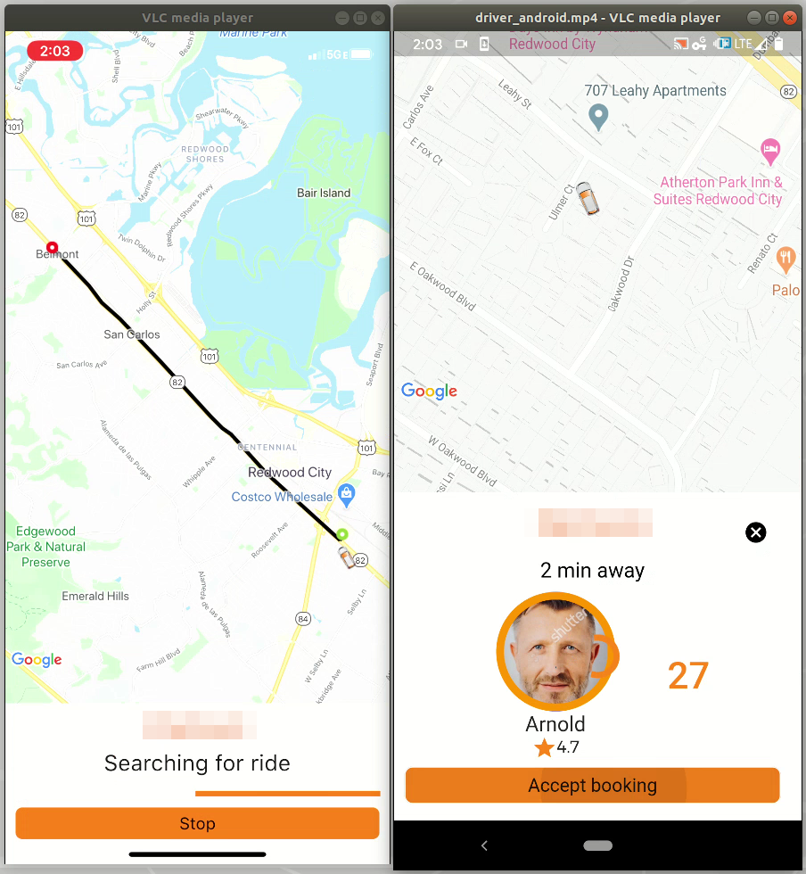

# Ridesharing-app

I recently worked as a volunteer for a startup, where I built a ride sharing app. Specifically, I built the backend on [Firebase](https://firebase.google.com/) and the frontend in [Flutter/Dart](https://flutter.dev/). It was a challenging project, where I worked on 4 apps simultaneously - rider and driver apps on both Android and iOS. 

I released a fully functional alpha version to Google's playstore. The code is proprietary and is not available. Below is a snapshot of the app. The demo video is available [here](https://www.youtube.com/embed/qQ7zoGiX8sE) or clicking on the image below

Left: Rider app running on **iPhone XR**
Right: Driver app running on **Google Pixel 3a** 
