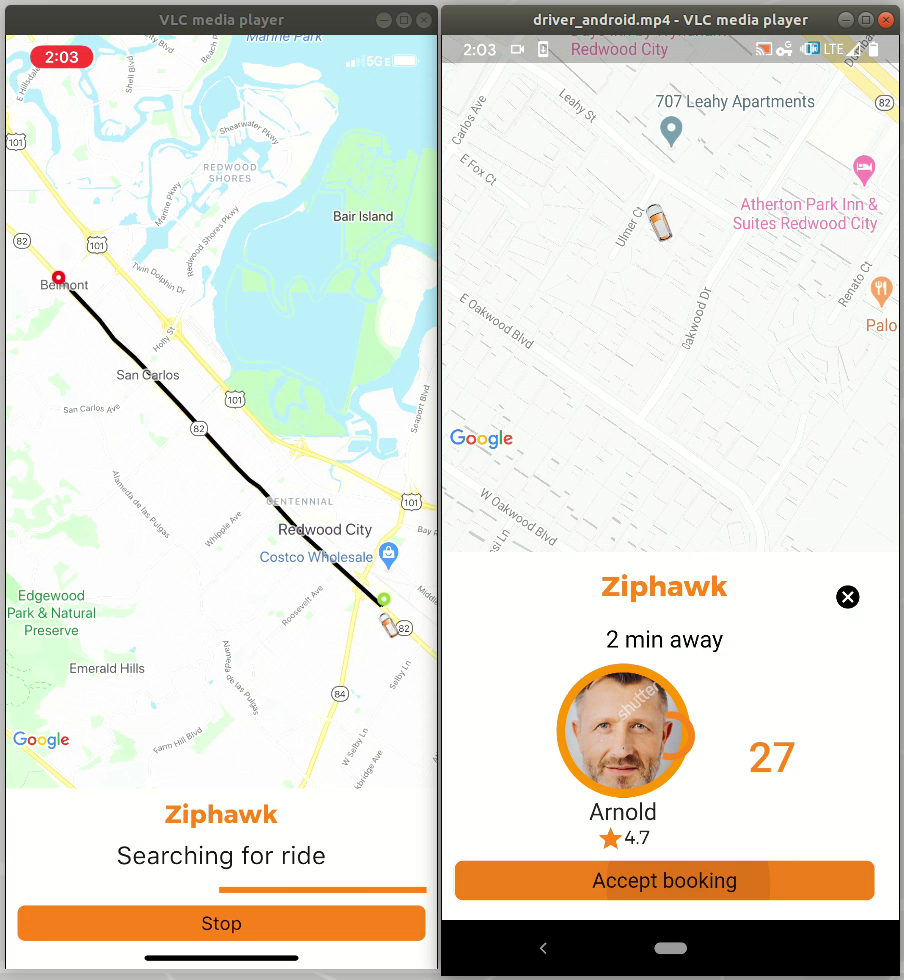

# Ridesharing-app

I recently worked on a ride sharing app as a volunteer for over 8 months. It was a great learning experience, where I built the backend on [Firebase](https://firebase.google.com/) and the frontend in [Flutter/Dart](https://flutter.dev/). It was a challenging project, where I worked on 4 app simulataneously - rider and driver apps on both Android and iOS. Thankfully, I was using Google's Flutter framework which helped mitigate a lot of code repetition and complexity. 

I was able to push out a fully functional alpha version to Google's playstore. I won't be able to share the code at this time as it is proprietary, but you can watch a **demo video** of the latest and greatest alpha release by clicking on the snapshot below

Left: Rider app running on **iPhone XR**
Right: Driver app running on **Google Pixel 3a** 
